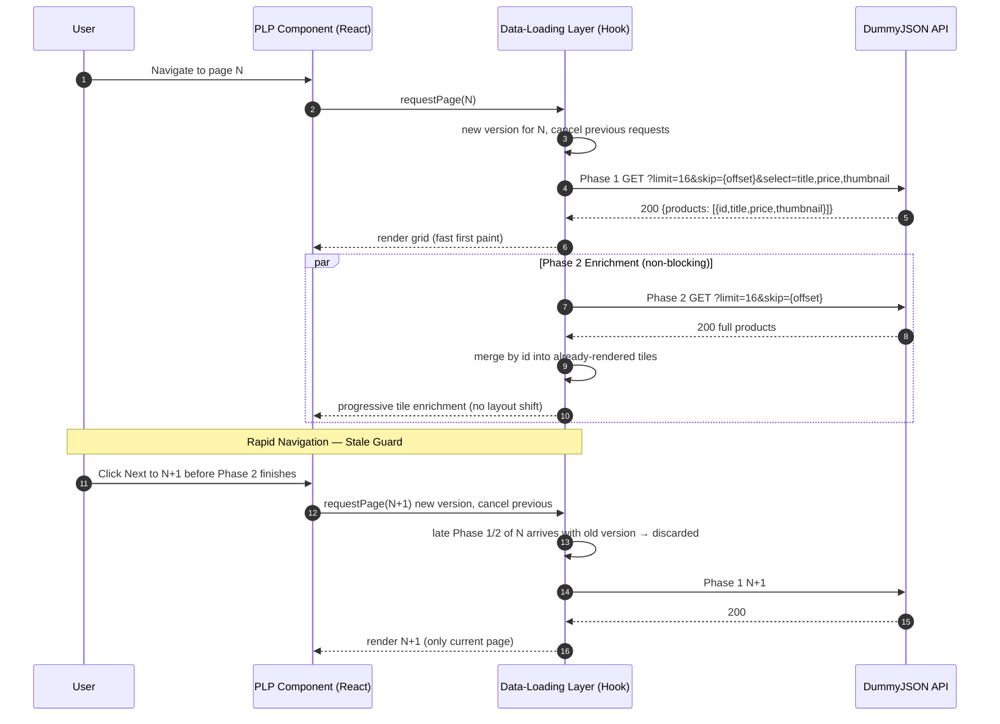

# GDI Products — Progressive Product Listing Page

## Overview
A Product Listing Page (PLP) built with React and TypeScript that uses a reusable progressive data-loading layer to render a fast first paint with minimal product data and then enriches each tile in the background. It browses a paginated product list from DummyJSON (16 per page by default, configurable 4–100 — outside that range the build fails with `tilesPerPage must be 4–100`).

## Getting Started

### Prerequisites
- **brew** (macOS) — `/bin/bash -c "$(curl -fsSL https://raw.githubusercontent.com/Homebrew/install/HEAD/install.sh)"`
- **node & npm** — `brew install node` or `nvm install 20 && nvm use 20`
- **docker & docker-compose** — `brew install --cask docker` (Docker Desktop includes `docker compose`)
- **make** — `xcode-select --install` (or `brew install make`)

Verify: `node -v`, `npm -v`, `docker --version`, `docker compose version`, `make -v`

### Install & Run
```bash
# install dependencies
npm install

# start the app in Docker (builds then serves at http://localhost:3000)
make up
# wait until ready (used by load-test)
make wait
# open http://localhost:3000
```

### Make Commands
- `make up` — builds the app and starts it in Docker at http://localhost:3000
- `make down` — stops and removes the container
- `make build` — compiles the app
- `make test` — runs unit tests (see Testing)
- `make dev` — serves the built app locally without Docker
- `make wait` — waits until http://localhost:3000 is ready
- `make load-test` — starts the app, waits, then runs the 4-shopper browser demo
- `make benchmark` — runs the hook benchmark (stubbed, no network)
- `make clean` — stops containers and removes built files
- `make logs` — tails app logs
- `make ps` — shows container status

Configure via `.env` (`API_BASE_URL`, `TILES_PER_PAGE=16`).

## Testing

`make test` runs unit tests with code coverage, displaying `100%` `statements/branches/functions/lines` and `Uncovered Line #s` when below threshold. `make test` must stay at `100%` before pushing.

## Benchmark vs Load Test

- **`benchmark.js` (`make benchmark`)** — Micro-benchmark of the two-phase hook logic with stubbed `150ms` per phase (no network, no browser). Measures `TTFP` (Time To First Paint after Phase 1) and `TTEn` (Time To Enriched after Phase 2) through the same hook the app uses, proving `TTFP` stays fast and `TTEn` is `Phase1+Phase2` sequential.

- **Load Test (`make up` then `make load-test`)** — End-to-end scalability of the running React app in a real browser. Launches 4 concurrent shoppers that each browse 5 pages at `http://localhost:3000` via Puppeteer, measuring `TTFP/LCP/CLS/INP/heap` on the actual grid, pagination, and enrichment. Requires the app to be up first (`make up` → `make wait`).

## How It Orchestrates Two Phases & Merges

*First, you get the picture fast.* The app asks the API for just what you need to paint the grid — titles, prices and thumbnails for 16 items. As soon as that arrives, the grid appears — that's your first paint.

*Then it quietly fills in the details.* Without blocking you, it fetches the full product data for the same page in the background and gently merges it into the tiles you already see.

*No flicker, no duplicates.* Items are matched by their unique id, so the title/price/thumbnail you saw stays put while descriptions, ratings, stock, images and the other fields slide in. The grid reserves space so the layout doesn’t jump.



## How It Prevents Stale Data

*What if you click Next really fast, before the previous page finishes?*

The app uses two safety nets. First, when you turn the page it immediately cancels any in-flight requests for the old page. Second, it hands each page visit a little version stamp — if an old, delayed response sneaks back late, the stamp won’t match the current page, so the app simply ignores it. This applies to both the fast list fetch and the background enrichment fetch.

The result you can feel: you always see data for the page you’re actually on — never a flash of the previous page’s details landing on top of the new one — even under rapid pagination.

## Project Structure

```
.
├── Dockerfile            # dev/build/prod multi-stage (node:20-alpine → nginx:alpine)
├── docker-compose.yml    # app service target:dev port 3000:3000
├── Makefile              # up/down/build/test/dev/wait/load-test/benchmark
├── benchmark.js          # hook benchmark (STUB=1 npx tsx benchmark.js)
├── load-test/
│   └── puppeteer-demo.js # 4-shopper demo (BASE_URL=http://localhost:3000 node ...)
├── src/
│   ├── api/              # fetchClient + DTOs + response envelope
│   ├── types/            # pure Product domain
│   ├── mappers/          # toProductMinimal / toProduct / mergeProducts
│   ├── hooks/            # useProgressiveProducts (orchestration outside components)
│   ├── components/       # ProductGrid + ProductTile + Pagination
│   ├── config/           # centralized config (TILES_PER_PAGE 4–100, API_BASE_URL)
│   └── index.css / app.css
├── jest.config.js        # ts-jest + jsdom + 100% thresholds
└── package.json
```

## Tradeoffs & Assumptions

- **Sequential enrichment:** Phase 2 runs only after Phase 1 succeeds, saving a wasted full fetch if the minimal fetch fails — but `TTEn` is the sum of both phases, not the max.
- **Fixed 16 pagination:** Simple Next/Previous + page number; not infinite scroll, not variable page size in UI.
- **Client-side mapping:** All API responses are mapped to an internal product model on the client; the API shape is assumed to always include `id` and at least `title/price/thumbnail` for the fast path, with other fields optional and enriched later.
- **Assumes DummyJSON:** `194` total products, `16` per page default. Different totals or page sizes would change `totalPages` and grid expectations but the hook logic would still apply.
